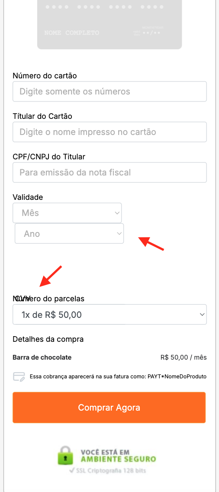

# Teste do time de QA

Este teste foi desenvolvido para avaliar habilidades para a vaga de QA da OtimizeMe. O foco é identificar, documentar e propor correções para falhas no sistema de checkout.

## Instruções

1. **Executar Testes Funcionais:**
   - Explore todos os fluxos de usuário no sistema de checkout.
   - Verifique diferentes métodos de pagamento.
   - Teste entradas inválidas ou incompletas e observe as respostas do sistema.

2. **Testes de Usabilidade:**
   - Avalie a interface e a facilidade de uso do sistema.

3. **Testes de Desempenho:**
   - Monitore os tempos de resposta do sistema durante diferentes etapas do checkout.

## Índice
- [Testes Funcionais](#testes-funcionais)
- [Testes de Usabilidade](#testes-de-usabilidade)
- [Testes de Desempenho](#testes-de-desempenho)

## Tarefas Realizadas

### Testes Funcionais

### Defeito 01: Falha no Preenchimento Automático do Endereço  

**Descrição:** O CEP não preenche os campos desabilitados (Endereço, Bairro, Cidade e Estado).

**Etapas:**
  1. Acesse a página [checkout](https://teste.homolog.payt.site/checkout).  
  2. Vá para a seção de endereço.  
  3. Tente digitar nos campos desabilitados.  
  4. Insira um CEP válido.  
  5. Insira um CEP inválido (ex: "101001-000").
  ```
   Resultado:
    - Verifique se ao inserir um CEP válido os campos de endereço são preenchidos automaticamente.
    - Verifique se ao inserir um CEP inválido o sistema rejeita e exibe erro.
  ```
**Evidências:** 

  

**Impacto:**  
  - Pode impedir a finalização da compra.  
  - Permite CEPs inválidos, gerando erros no pedido.  
  - Confunde o usuário.

**Solução Sugerida:**  
  - Preencher automaticamente os campos ao inserir um CEP válido.  
  - Adicionar máscara e validação ao campo de CEP.  
  - Exibir erro para CEPs inválidos.

**Cenários alternativos:** 

- Repita as etapas inserindo um CEP válido e depois apagando para verificar se os campos desabilitados voltam a ficar vazios.
- Insira um CEP válido e altere manualmente outro campo de endereço (se possível) para ver se o sistema mantém ou substitui a alteração.
- Tente atualizar a página após preencher um CEP válido para ver se os dados são mantidos.

### Defeito 02: Limite de Caracteres nos Campos de Entrada  

**Descrição:** Os campos de "Nome", "Email", "CEP", "Número" e "Complemento" não possuem limite de caracteres, permitindo inserção excessiva de texto.  

**Etapas:**  
  1. Acesse a página [checkout](https://teste.homolog.payt.site/checkout).  
  2. Insira um nome com mais de 100 caracteres (ex: "JoanaMariaClaraFernandaOliveiraSantosPereiraBarbosaSilvaSouzaRodriguesCostaMeloGomesMartinsLimaAraujoAlmeidaNascimentoCardoso").  
  3. Insira um email com mais de 150 caracteres.  
  4. Insira um CEP com mais de 9 caracteres.  
  5. Insira um número de endereço maior que 10 caracteres.  
  6. Insira um campo de complemento com mais de 100 caracteres.
  7. Insira um título de cartão com mais de 100 caracteres.  
  ```
    Resultado:
    - Verifique se campos com caracteres além do limite são rejeitados ou causam erro.  
    - Verifique se a interface não quebra e os dados são processados corretamente.
  ```

**Evidências:** 
.  

**Impacto:**  
  - Pode causar problemas de formatação na interface.  
  - Dados excessivos podem impactar a performance e a integridade ao serem enviados ao banco.

**Solução Sugerida:**  
  - Definir limites de caracteres para cada campo (ex: 100 para "Nome", 150 para "Email", 9 para "CEP", 10 para "Número", 100 para "Complemento").  
  - Adicionar validação e exibir mensagens de erro caso o limite seja ultrapassado.

**Cenários alternativos:** 
   - Testar caracteres especiais e emojis nos campos para verificar se há alguma quebra inesperada.

### Defeito 03: Falta de Alerta para Campos Obrigatórios Não Preenchidos  

**Descrição:** O sistema não exibe um alerta para campos obrigatórios (como Nome, Email, CEP, Número e Título do Cartão) ao tentar finalizar a compra.

**Etapas:**
  1. Acesse a página [checkout](https://teste.homolog.payt.site/checkout).  
  2. Deixe os campos obrigatórios em branco (ex: Nome, Email, CEP, Número, Título do Cartão).  
  3. Clique no botão "Comprar Agora".
  ```
    Resultado:
     - Verifique se o sistema exibe um alerta ao tentar finalizar a compra sem preencher os campos obrigatórios.
     - Verifique se os campos não preenchidos são destacados corretamente.
  ```
**Evidências:** !
- [Gravação de Tela](https://app.box.com/s/gmu1wv9t6zmpmt2itl9hd2cvbmhvnnn1)  

**Impacto:**  
- Impede a finalização da compra.
- Falta de validação pode gerar confusão e erros de processamento.

**Solução Sugerida:**  
- Validação nos campos obrigatórios com alerta ao tentar concluir a compra sem preenchê-los.
- Adicionar asteriscos na label de campos obrigatórios.
- Destacar campos não preenchidos com mensagem de erro.

**Cenários alternativos:** 
- Preencher apenas parte dos campos obrigatórios e tentar avançar para ver quais campos são validados primeiro.
- Inserir espaços em branco nos campos obrigatórios para verificar se o sistema os reconhece como preenchidos.


### Defeito 04: Falha no Componente de Seleção de País  

**Descrição:** O componente **select** para selecionar o país não apresenta nenhuma opção de país para o usuário escolher.

**Etapas:**
  1. Acesse a página [checkout](https://teste.homolog.payt.site/checkout).  
  2. Localize o campo "Alterar país" no topo do formulário.  
  3. Clique na caixa de seleção.  
  4. Observe que nenhuma opção é exibida.
  ```
    Resultado:
    - Verifique se o select apresenta a lista de países para o usuário escolher.
    - Verifique se a seleção de país afeta corretamente o valor do produto ou outras opções, como o envio. 
  ```
**Evidências:** 

**Impacto:**  
- Usuário pode não conseguir selecionar o país corretamente.
- Pode impedir a finalização da compra caso o país seja um fator obrigatório para o pagamento ou envio.
  
**Solução Sugerida:**  
- Preencher o **select** com a lista de países.  
- Verificar o carregamento dinâmico e adicionar um fallback caso falhe.

**Cenários alternativos:**
- Tentar avançar no checkout sem escolher um país para ver se há validação.

### Defeito 05: Falta de Exibição do Nome do Titular e Validade do Cartão  

**Descrição:** O nome do titular e a validade do cartão não são exibidos na interface do cartão enquanto são digitados.

**Etapas:**
  1. Acesse a página [checkout](https://teste.homolog.payt.site/checkout).  
  2. Localize o campo de inserção de dados do cartão de crédito.  
  3. Insira o nome do titular no campo correspondente.  
  4. Insira a validade do cartão.

  ```
    Resultado:
    - Verifique se o nome do titular e a validade do cartão são exibidos na interface do cartão enquanto são digitados.
    - Verifique se todos os campos de dados do cartão têm feedback visual consistente.
  ```
**Evidências:** 
- 

**Impacto:**  
- Falta de feedback visual pode confundir o usuário.
- Pode levar a erros na digitação dos dados do cartão.

**Solução Sugerida:**  
- Exibir o nome do titular e a validade na interface do cartão enquanto são digitados.
- Garantir que todos os campos de dados do cartão tenham feedback visual consistente.

**Cenários alternativos:** 
- Digitar o nome do titular com caracteres especiais ou números para ver se o sistema lida corretamente.
- Inserir uma validade de cartão incorreta (ex: "00/00") e verificar o comportamento.

### Testes de Usabilidade

### Defeito 06: Título de boleto constado no Método de Pagamento Pix

**Descrição:** O título "Libere sua compra rapidamente pagando com o Boleto!" aparece na interface do pagamento com Pix.

**Etapas:**
1. Acesse a página [checkout](https://teste.homolog.payt.site/checkout).
2. Localize o campo de pagamento com Pix.
3. Verifique o texto "Libere sua compra rapidamente pagando com o Boleto!".
  ```
    Resultado:
    - Verifique se o título "Libere sua compra rapidamente pagando com o Boleto!" está aparente no método de pagamento com Pix.
  ```

**Evidências:** 

**Impacto:**  
- Usuário pode escolher um método de pagamento incorreto para a sua necessidade.
- Afeta a clareza e confiança no processo de pagamento.

**Solução Sugerida:**
- Remover o texto relacionado ao pagamento via Pix e, se necessário, transferi-lo para a opção de pagamento por boleto.

**Cenários alternativos:**
- Verificar se o mesmo título aparece em outros métodos de pagamento.

### Defeito 07: Campo de Taxa pouco visível

**Descrição:** O campo de taxa adicional é exibido de forma muito pequena na página de checkout, o que dificulta sua visualização.

**Etapas:**
1. Acesse a página [checkout](https://teste.homolog.payt.site/checkout).
2. Localize o campo de taxa a baixo do método de pagamento.
3. Verifique o campo de taxa adicional.
  ```
    Resultado:
    - Verifique se o campo de taxa adicional é exibido de forma pouco visível na interface.
  ```
**Impacto:**  
- Falta de transparência pode afetar a confiança do usuário nas condições de compra.
- Usuário pode não perceber e confusão no momento do pagamento.

**Solução Sugerida:**
- Exibir a taxa adicional com fonte maior ou em local mais destacado na interface.
- Incluir uma mensagem de melhor compreensão, como "Taxa adicional mensal".

### Defeito 08: Problemas de Layout em Dispositivos Móveis

**Descrição:** Elementos do layout do formulário não redimensionam corretamente ao visualizar em telas menores ou em dispositivos móveis.

**Etapas:**
1. Acesse a página [checkout](https://teste.homolog.payt.site/checkout) em um dispositivo móvel ou navegador.
   - No navegador, ative o modo de design:
     - Mac: Utilize `cmd + opt + m`
     - Windows (ou Linux): Utilize `ctrl + shift + m`
2. Verifique os elementos do formulário, nas seções de informações pessoais e cartão de crédito.
  ```
    Resultado:
    - Verifique se os selects de desalinhados na tela e sem espaçamento adequado na tela.
    - Verifique se os campos de input das informações pessoais estão desalinhados e sem espaçamento adequado na tela.
    - Verifique se no método de pagamento, o label do "CVV" do cartão de crédito está sobrepondo o label "Número de parcelas".
  ```

<div style="display: flex; justify-content: center; align-items: center;">
    
    
</div><br>

**Impacto:**
- Prejudica a experiência de compra em dispositivos móveis.
- Pode levar a erros no preenchimento de informações, fazendo o usuário não conseguir identificar corretamente o campo para inserir os dados.

**Solução Sugerida:**
- Utilização de media queries para ajuste de layout em diferentes tamanhos de tela.

**Cenários alternativos:**
- Testar a mesma página em diferentes tamanhos de tela (smartphone, tablet, etc.) para garantir a resolução do problema.
- Verificar o comportamento de labels e inputs em diferentes orientações de tela.


### Testes de Desempenho

### Teste com Cypress: Monitoramento do Tempo de Resposta Durante o Processo de Checkout.

**Descrição**:
Este teste utiliza o Cypress para monitorar o tempo de resposta de cada etapa do processo de checkout, assegurando eficiência e uma experiência mais otimizada.

**Pre-condição:**
  - Instale o [Node](https://nodejs.org/en/download).
  - Instale o [Cypress](https://docs.cypress.io/app/get-started/install-cypress).
    
**Etapas:**
  - Clone o repositório do **test_otimizeme** em seu local.
  - Abra o repositório no terminal
  - Utilize o caminho do automation.
    - Rode: `cd automation`
  - Rode o comando: `npx cypress run --spec "cypress/tests/checkout.cy.js"`.
  - Verifique os resultados no terminal.

### Resultados Cypress:

| Etapa                                | Tempo registrado (s) |
|--------------------------------------|---------------------|
| Carregamento da página               | 1.53  |
| Preenchimento dos dados do usuário   | 7.48  |
| Seleção do método de pagamento       | 0.08  |
| Inserção dos dados do cartão de crédito | 5.42  |
| Finalização da compra                | 0.11  |


**Avaliação:**

- Os tempos de resposta registrados estão dentro dos limites aceitáveis para a experiência do usuário.
- O preenchimento dos dados do usuário e a inserção dos dados do cartão de crédito demoram mais tempo, possivelmente devido à complexidade dessas etapas.


**Evidências:** 

- 
- 


### Teste com K6: Avaliação de Desempenho da Página de Checkout

**Descrição:** Este teste utiliza o K6 para medir o desempenho da página de checkout sob carga, garantindo sua estabilidade e eficiência.

**Pre-condição:**

- Instale o [K6](https://grafana.com/docs/k6/latest/set-up/install-k6/).

**Etapas:**
  - Clone o repositório do **test_otimizeme** em seu local.
  - Abra o repositório no terminal
  - Utilize o caminho de performance.
    - Rode: `cd performance`
  - Rode o comando: `k6 run load-test.js"`.
  - Verifique os resultados no terminal.

### Resultados K6:

- **Status:** 200 (100.00% sucesso)
- **Dados Recebidos:** 64 MB (531 kB/s)
- **Dados Enviados:** 293 kB (2.4 kB/s)
- **Requisição HTTP Bloqueada:**
  - Média: 698.71µs
  - Mínimo: 0s
  - Mediana: 1µs
  - Máximo: 258.26ms
  - Percentil 90: 2µs
  - Percentil 95: 2µs
- **Conexão HTTP:**
  - Média: 168.35µs
  - Mínimo: 0s
  - Mediana: 0s
  - Máximo: 29.45ms
  - Percentil 90: 0s
  - Percentil 95: 0s
- **Duração da Requisição HTTP:**
  - Média: 163.17ms
  - Mínimo: 139.53ms
  - Mediana: 154.86ms
  - Máximo: 582.77ms
  - Percentil 90: 170.84ms
  - Percentil 95: 185.44ms
- **Requisições HTTP Falhadas:** 0.00% (0 de 2713)
- **Recebimento de Requisição HTTP:**
  - Média: 2.05ms
  - Mínimo: 102µs
  - Mediana: 226µs
  - Máximo: 132.71ms
  - Percentil 90: 523.8µs
  - Percentil 95: 1.5ms
- **Envio de Requisição HTTP:**
  - Média: 129.55µs
  - Mínimo: 36µs
  - Mediana: 100µs
  - Máximo: 13.58ms
  - Percentil 90: 159.8µs
  - Percentil 95: 198µs
- **Handshake TLS de Requisição HTTP:**
  - Média: 447.4µs
  - Mínimo: 0s
  - Mediana: 0s
  - Máximo: 75.45ms
  - Percentil 90: 0s
  - Percentil 95: 0s
- **Espera de Requisição HTTP:**
  - Média: 160.99ms
  - Mínimo: 138.93ms
  - Mediana: 154.36ms
  - Máximo: 554.44ms
  - Percentil 90: 170.08ms
  - Percentil 95: 184.35ms
- **Requisições HTTP Totais:** 2713 (22.536521/s)
- **Duração das Iterações:**
  - Média: 1.16s
  - Mínimo: 1.14s
  - Mediana: 1.15s
  - Máximo: 1.78s
  - Percentil 90: 1.17s
  - Percentil 95: 1.19s
- **Iterações Totais:** 2713 (22.536521/s)
- **Virtual Users (VUs):**
  - Mínimo: 1
  - Máximo: 50
- **Máximo de Virtual Users (VUs):** 50 (mínimo 50, máximo 50)

**Avaliação:**

- Os resultados mostram uma alta taxa de sucesso (100%) das requisições HTTP, o que indica que o sistema se comporta bem sob carga.
- Os tempos médios de bloqueio, conexão e duração das requisições HTTP são aceitáveis, mas há espaço para melhorias.
- A estabilidade dos usuários virtuais sugere que o sistema é capaz de lidar com a carga sem degradação significativa no desempenho.
- Considerar otimizações no tempo de espera das requisições HTTP para garantir tempos de resposta ainda mais rápidos.

**Evidências:**

- 
